# Lambda Error Analyzer & Alerter
## 🚀 Project Overview
This project is a serverless log analysis and alerting system built entirely on AWS. It is designed to capture, store, and intelligently analyze application logs in real time. Using a sophisticated event-driven pipeline, the system identifies recurring or critical error patterns, summarizes them using AI, and sends polished, actionable alerts to developers via Email and Slack.

The primary goal is to move beyond simple log monitoring and provide a system that reduces alert fatigue by only notifying developers about issues that are statistically significant or new, complete with rich context to accelerate debugging.

A key feature of this architecture is the stateful filtering mechanism. The `FilterAlert` Lambda queries a dedicated DynamoDB table to access historical data, allowing it to perform statistical analysis and determine if an error's frequency is genuinely anomalous or just noise.

This project was built for the AWS Lambda Hackathon.

## 👥 Team
This project was created by a dedicated team for the AWS Lambda Hackathon.

- Minh Tran [@cutun](https://github.com/cutun)
- Eric Wang [@SUPERIC520](https://github.com/SUPERIC520)
- Hunter Chan [@hchan54](https://github.com/hchan54)

## 🏗️ System Architecture & Alert Flow
The application is built on a professional-grade, 4-stage, event-driven serverless architecture. Each stage is handled by a dedicated AWS Lambda function that performs a single, specific task. This separation of concerns makes the system robust, scalable, and easy to maintain.

---
### Visual Architecture Diagram

```mermaid
graph TD
    %% ───────── Styles ─────────
    classDef lambda  fill:#FF9900,stroke:#333,stroke-width:2px,color:#fff;
    classDef db      fill:#2E73B8,stroke:#333,stroke-width:2px,color:#fff;
    classDef service fill:#232F3E,stroke:#333,stroke-width:2px,color:#fff;
    classDef topic   fill:#D84B9A,stroke:#333,stroke-width:2px,color:#fff;
    classDef user    fill:#fff,stroke:#333,stroke-width:2px,color:#333;
    classDef decision stroke-dasharray:5 5;

    %% ───────── STAGE 1 – INGESTION ─────────
    subgraph INGESTION
        A[External Logs] --> API_GW[API Gateway];
        API_GW -- /logs --> IngestLambda(IngestLog Lambda);
        IngestLambda --> Firehose[Kinesis Firehose];
        Firehose --> RawLogs[(S3 Raw Logs)];
    end

    %% ───────── STAGE 2 – ANALYSIS ─────────
    subgraph ANALYSIS
        RawLogs -- S3 Event --> AnalyzeLambda(AnalyzeLog Lambda);
        AnalyzeLambda -- AI Summary --> AnalysisDB[(Analysis Results DB)];
    end

    %% ───────── STAGE 3 – FILTERING ─────────
    subgraph FILTERING
        AnalysisDB -- DynamoDB Stream --> FilterLambda(FilterAlert Lambda);
        FilterLambda <--> HistoryDB[(Historical Stats DB)];
        FilterLambda --> IsWorthy{Is Alert Worthy?};
    end

    %% ───────── STAGE 4 – NOTIFICATION ─────────
    subgraph NOTIFICATION
        IsWorthy -- Yes --> AlertTopic(SNS Topic);
        IsWorthy -- No  --> Stop(Stop);
        AlertTopic -- SNS Trigger --> SendLambda(SendAlert Lambda);
        SendLambda --> Notifications{Email & Slack};
    end
    
    %% ───────── STAGE 5 – UI ─────────
    subgraph UI
        Developer[Developer] --> Frontend[Web UI];
        Frontend -- /history --> API_GW;
        API_GW -- /history --> GetHistoryLambda(GetHistory Lambda);
        GetHistoryLambda --> HistoryDB;
    end

    %% ───────── Apply styles ─────────
    class Developer user;
    class IngestLambda,AnalyzeLambda,FilterLambda,SendLambda,GetHistoryLambda lambda;
    class RawLogs,AnalysisDB,HistoryDB db;
    class API_GW,Firehose service;
    class AlertTopic topic;
    class IsWorthy,Stop,Notifications decision;
```

### Step-by-Step Data Flow
1. **Ingestion:** A client sends a log file to a **public API** Gateway endpoint which invokes the `ingest_log` lambda. The function immediately streams the log record into an `Amazon Kinesis Data Firehose` delivery stream, and Firehose then deposits the raw log object into the S3 bucket.

2. **Analysis:** The new object in S3 triggers the `AnalyzeLog` Lambda. This function reads the file, clusters logs by signature, and uses **Amazon Bedrock** to generate an AI summary. The complete, structured analysis result is then saved to an **Analysis Results DynamoDB Table**.

3. **Filtering:** The Analysis Results table has a **Stream** enabled, which triggers the `FilterAlert` Lambda on any new item. This function acts as a smart gatekeeper, querying a separate **Historical Stats DynamoDB Table** to compare the current error frequency against its baseline and decide if the event is truly anomalous.

4. **Notification:** If the filter deems the alert important, it publishes the analysis result to a final **SNS Topic**. The `SendAlert` Lambda receives this message, uses a custom formatter to create beautiful HTML Email and Slack messages, and sends them to the configured recipients.

5. **History Querying:** A developer accesses the **Web Frontend** hosted on CloudFront. The frontend makes a call to a dedicated `/history` API Gateway endpoint, which triggers the `GetHistory` Lambda. This function queries the **Historical Stats DynamoDB** to return occurrence counts for specific error signatures, displaying the trend data to the user.

## ✨ Key Features
- **Event-Driven & Decoupled:** Uses a 4-stage microservices pipeline connected by S3 Events, DynamoDB Streams, and SNS for maximum scalability.

- **AI-Powered Summarization:** Leverages Amazon Bedrock (Nova Micro) to provide human-readable summaries of complex error patterns.

- **Intelligent Filtering:** A dedicated Lambda with its own state in a DynamoDB table performs statistical analysis to filter noise and only alert on anomalous events.

- **Interactive Web UI:** A serverless frontend deployed on S3 and CloudFront provides a dashboard for querying historical error counts and trends directly.

- **Polished Notifications:** Generates professional, easy-to-read alert digests for both Email (HTML) and Slack (Block Kit).

- **Infrastructure as Code (IaC):** The entire application is defined and deployed using the AWS CDK, allowing for repeatable and maintainable infrastructure.

- **Scalable Data Handling:** Uses a robust ingestion pattern and the "Metadata in DynamoDB, Data in S3" pattern to handle large log volumes.

## 🛠️ Project Setup & Deployment
This project is built using the AWS CDK (Cloud Development Kit).

### Prerequisites
1. An AWS Account with credentials configured locally (`aws configure`).
   * **Default region name:** `us-east-1`  
   * **Default output format:** `json` 
   * **IAM user policies:**  `AdministratorAccess`, `AmazonBedrockFullAccess`, `AmazonDynamoDBFullAccess_v2`,  
   `AmazonS3ReadOnlyAccess`, `AmazonSNSFullAccess`, `CloudWatchFullAccess`

2. Python, Node.js, and npm installed.

3. AWS CDK Toolkit installed (`npm install -g aws-cdk`).

4. A verified email identity in Amazon SES.

5. **Bedrock Model Access Enabled:** You must manually enable access to the foundation models in the AWS Bedrock console.
   * Navigate to **Amazon Bedrock** in the AWS Console.
   * In the bottom-left menu, click **Model access**.
   * Click **Manage model access** and grant access to the **Amazon** models, which includes "Nova Micro".
   * **Important:** Ensure you do this in the same AWS region you are deploying the stack to (e.g., `us-east-1`).

### Deployment Steps
1. Clone the repository:
    ```
    git clone https://github.com/cutun/lambda-error-analyzer.git
    cd lambda-error-analyzer
    ```
2. Set up the Python virtual environment:
    ```
    python -m venv .venv
    # On Windows: .\.venv\Scripts\activate
    # On Mac/Linux: source .venv/bin/activate
    ```
3. Install all dependencies:
    ```
    pip install -r requirements.txt
    ```
4. Bootstrap your AWS environment for CDK (for AI-summary to work, region has to be set to `us-east-1`):
    ```
    cdk bootstrap
    ```
5. Deploy the stack. You must provide the required parameters.
    ```
    cdk deploy \
     --parameters VerifiedSenderEmail="your-verified@email.com" \
     --parameters RecipientEmail="your-alert@email.com" \
     --parameters SlackWebhookSsmParamName="slack-webhook-url (required: can be empty string if unused)"
    ```
## 🚀 Usage
### Sending Test Logs
After a successful deployment, the CDK will output the `ApiIngestionEndpointUrl`

1. Locate or create a sample log file (e.g., sample_logs/test.log).

2. Update your local `.env` file with the live API endpoint URL.
    ```
    LOG_API=<ApiIngestionEndpointUrl>
    ```

3. Run the test client to send the log file to the live API:
    ```
    python tests/push_sample_log.py tests/sample_logs/test.log
    ```

4. Check your configured email and Slack channel for the polished alert digest.

    *\* The email will be in spam if sender email is not part of a verified domain.*\
        *__\*WARNING: UPLOADING LARGE LOGS MAY RESULT IN LOTS OF EMAILS!!!__*\
    *(Please keep it under 10MB)*

### Using the Web Frontend
1. After deployment, navigate to the `FrontendURL` provided in the CDK stack outputs.

2. Paste the `ApiHistoryEndpointUrl` (also from the stack outputs) into the API URL field on the web page.000000

3. Enter the Log Level and Error Message you wish to query.

4. Click "Fetch History" to see the occurrence count for that error signature over the specified time window.
